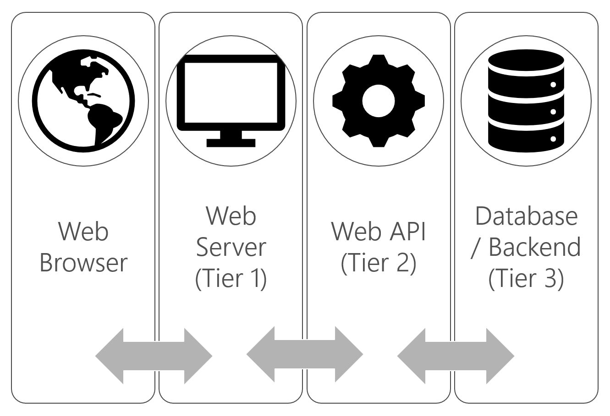
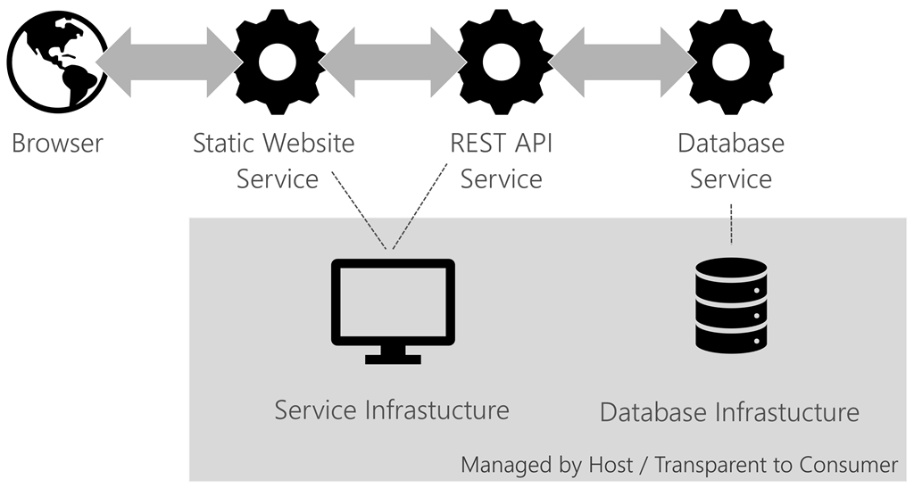

# Architecture approaches

Understanding existing approaches to architecting enterprise apps helps clarify the role played by serverless. There are many approaches and patterns that evolved over decades of software development, and all have their own pros and cons. In many cases, the ultimate solution may not involve deciding on a single approach but may integrate several solutions. Migration scenarios often involve shifting from one architecture approach to another through a hybrid approach. This chapter provides an overview of both logical and physical architecture patterns for enterprise applications.

> TODO: add relevant contextual links

## N-Tier applications

The [N-Tier architecture pattern](https://docs.microsoft.com/azure/architecture/guide/architecture-styles/n-tier) is a mature architecture and simply refers to applications that separate various components of functionality into logical layers that span physical tiers. The most common implementation of this architecture includes:

* A presentation tier, for example a web app
* An API and/or data access tier, such as a REST API
* A data tier, such as a SQL database

N-tier solutions have the following characteristics:

* Projects are typically aligned with tiers
* Testing may be approached differently by tier
* Tiers provide layers of abstraction, for example the presentation tier is typically ignorant of the implementation details of the data tier
* Releases are often managed at the project, and therefore tier, level, so a simple API change may result in a new release of an entire middle tier

This approach provides several benefits, including:

* Isolation of the database (often the frontend doesn't have direct access to the database backend)
* Reuse of the API (for example, mobile, desktop, and web app clients can all reuse the same APIs)
* Ability to scale out tiers independent of each other
* Refactoring isolation: one tier may be refactored without impacting other tiers

## Microservices

The term **[microservices](https://docs.microsoft.com/azure/architecture/guide/architecture-styles/microservices)** has recently gained popularity. Although there is no universally accepted definition of microservices, there are many common traits of microservices architectures. Characteristics include:

* Applications are composed of several small services
* Each service runs in its own process
* Services are aligned around business domains
* Services communicate over lightweight APIs, typically using HTTP as the transport
* Services can be deployed and upgraded independently
* Services are not dependent on a single data store
* The system is designed with failure in mind, and the app may still run even when certain services fail

Microservices don't have to be mutual to other architecture approaches. For example, an N-Tier architecture may use microservices for the middle tier. It is also possible to implement microservices in a variety of ways, from virtual directories on IIS hosts to containers. The characteristics of microservices make them especially ideal for serverless implementations.

The pros of microservices architectures include:

* Refactoring is often isolated to a single service
* Services can be upgraded independently of each other
* Resiliency and elasticity can be tuned to the demands of individual services
* Development can happen in parallel across disparate teams and platforms
* It is easier to write tests for isolated services

Microservices come with their own challenges, including:

* Determining what services are available and how to call them
* Managing the lifecycle of services
* Understanding how services fit together in the overall application
* End-to-end testing of calls made across disparate services

Ultimately there are solutions to address all of these challenges, including tapping into the benefits of serverless that are discussed later.

## On-premises and Infrastructure-as-a-Service (IaaS)

The traditional approach to hosting applications is to own the entire platform. Originally this involved expensive data centers and physical hardware. The challenges that come with operating physical hardware are numerous, including:

* The need to over-purchase for "just in case" scenarios
* Securing physical access to the hardware
* Responsibility for hardware failure (such as disk failure)
* Cooling
* Configuring routers and load balancers
* Power redundancy
* Securing access

> TODO: IaaS diagram

Virtualization of hardware, via "virtual machines" enables Infrastructure-as-a-Service (IaaS). Host machines are effectively partitioned to provide resources for instances that are allocated their own memory, CPU, and storage. The team provisions the necessary VMs and configures the associated networks and access to storage.

> See the [virtual machine N-tier reference architecture](https://docs.microsoft.com/en-us/azure/architecture/reference-architectures/virtual-machines-windows/n-tier).

Although virtualization and Infrastructure-as-a-Service (IaaS) address many concerns, it still leaves much responsibility in the hands of the infrastructure team. The team is responsible for maintaining operating system versions, applying security patches, and installing third-party dependencies on the target machines. A common issue is that apps behave differently on production machines compared to the test environment. Issues arise due to different dependency versions and/or OS SKU levels. It is common to deploy N-Tier applications to these targets, but microservices are more challenging due to the requirements to scale out for elasticity and resiliency.

## Platform-as-a-Service (PaaS)

Platform-as-a-Service (PaaS) offers configured solutions that developers can plug into directly. PaaS is another term for managed hosting. It eliminates the need to manage the base operating system, security patches and in many cases any third-party dependencies. Examples of platforms include web applications, databases, and mobile back-ends. Using IaaS the developer has to ensure:

* The target environment is the correct operating system
* The right frameworks installed
* The environment is configured correctly
* The virtual machine hosts the right dependencies

PaaS addresses these requirements and allows the developer to focus on the code or database schema rather than how it gets deployed. Benefits of PaaS include:

* Pay for use models that eliminate the overhead of investing in idle machines
* Direct deployment and improved DevOps, CI, and CD pipelines
* Automatic upgrades, updates, and security patches
* Push-button scale out and scale up

The main disadvantage of PaaS traditionally has been vendor lock-in. For example, some solutions only support ASP. NET, Node.js, or other specific languages and platforms. Products like Azure App Service have evolved to address multiple platforms and support a variety of languages and frameworks for hosting web apps.

## Software-as-a-Service (SaaS)

Software-as-a-Service or SaaS is similar to PaaS. The software is centrally hosted and available without local installation or provisioning. The difference is that PaaS is a platform for deploying software, whereas SaaS provides services to run and connect with existing software. PaaS is a general platform for deploying a variety of solutions. SaaS is often industry and vertical specific. SaaS is usually licensed and typically provides a client/server model. Most modern SaaS offerings use web-based apps for the client. Companies typically consider SaaS as a business solution to license offerings. It is not often implemented as architecture consideration for scalability and maintainability of an application. Indeed, most SaaS solutions are built on IaaS, PaaS, and/or serverless back-ends.

> TODO: SaaS diagram

## Containers and Functions-as-a-Service (FaaS)

Containers are an interesting solution that enables PaaS-like benefits without the IaaS overhead. A container is essentially a runtime that contains the bare essentials needed to run a unique application. The kernel and services such as storage, etc. are shared across a host. Shared kernel enables containers to be lightweight (some are mere megabytes in size, compared to the gigabyte size of typical virtual machines). With hosts already running, containers can be started quickly, facilitating high availability. The ability to spin up containers quickly also provides extra layers of resiliency. Benefits include:

* Lightweight and portable
* Self-contained so no need to install dependencies
* Images provide a consistent environment regardless of the host (runs exactly same on a laptop as on a cloud server)
* Can be provisioned quickly for scale-out
* Can be restarted quickly to recover from failure

Containers do require a host. For true failover and resiliency, containers must be scaled across hosts. Managing containers across hosts typically requires an orchestration tool such as Kubernetes. Configuring and managing orchestration solutions may add additional overhead and complexity to projects. Fortunately, many cloud providers provide orchestration services through PaaS solutions to simplify the management of containers.

> TODO: Container diagram

Functions-as-a-Service (FaaS) is another term for serverless and will be covered in the next section. A specific implementation of FaaS, called [OpenFaaS](https://github.com/openfaas/faas), sits on top of containers to provide serverless capabilities. OpenFaaS provides templates that package all of the container dependencies necessary to run a piece of code. Using templates simplifies the process of deploying code as a functional unit. OpenFaaS targets architectures that already include containers and orchestrators because it can use the existing infrastructure.

## Serverless

Serverless is an architecture that relies heavily on abstracting away the host environment to focus on code. It can be thought of as *less server*. Container solutions provide developers existing build scripts to publish code to serverless-ready images. Other implementations use existing PaaS or container-based solutions to provide a scalable architecture. The abstraction means the DevOps team does not have to provision or manage servers, nor specific containers. The serverless platform hosts code, either as script or packaged executables built with a related SDK, and allocates the necessary resources for the code to scale.

A common way to think about serverless is as a code and a trigger. The trigger might be manual, a timed process, an HTTP request, or a file upload. The result of the trigger is the execution of code. Although serverless platforms vary, most provide access to pre-defined APIs and bindings to streamline tasks such as writing to a database or queueing results.

> TODO: diagram showing various triggers connecting to code outputting to results

The advantages of serverless include:

* **High density.** Many instances of the same serverless code can run on the same host compared to containers or virtual machines.
* **Micro-billing**. Most serverless providers bill based on serverless executions, enabling massive cost savings in certain scenarios.
* **Instant scale**. Serverless can scale to match workloads automatically and quickly.
* **Faster time to market** Developers focus on code and deploy directly to the serverless platform. Components can be released independently of each other.

> TODO: serverless diagram

Serverless is most often discussed in the context of compute, but can also apply to data. This book focuses on serverless compute.

## Summary

There is a broad spectrum of available choices for architecture, including a hybrid approach. Serverless simplifies the approach, management, and cost of application features at the expense of control and portability. However, many serverless platforms do expose configuration to help fine-tune the solution. Good programming practices can also lead to more portable code and less serverless platform lock-in. The following diagram illustrates the physical architecture approaches side by side.

> TODO: Show chart with all approaches and responsibility

## Recommended resources

* [Architecture styles](https://docs.microsoft.com/azure/architecture/guide/architecture-styles/)

>[!div class="step-by-step"]
[Previous] (../index.md)
[Next] (../serverless-architecture/index.md)
